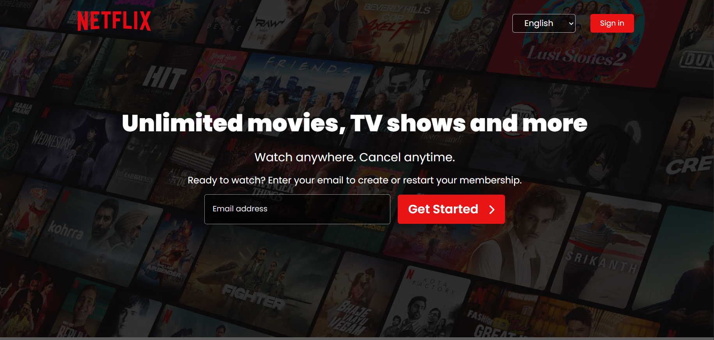
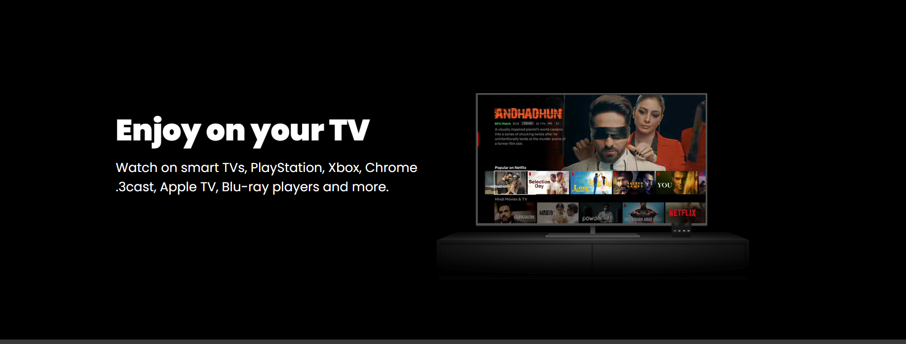
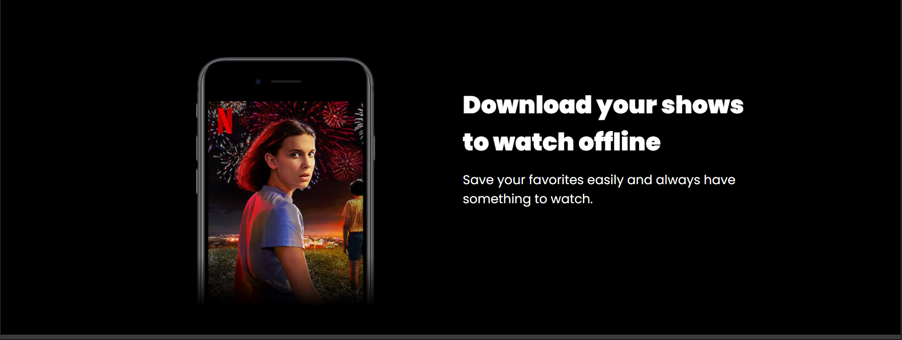
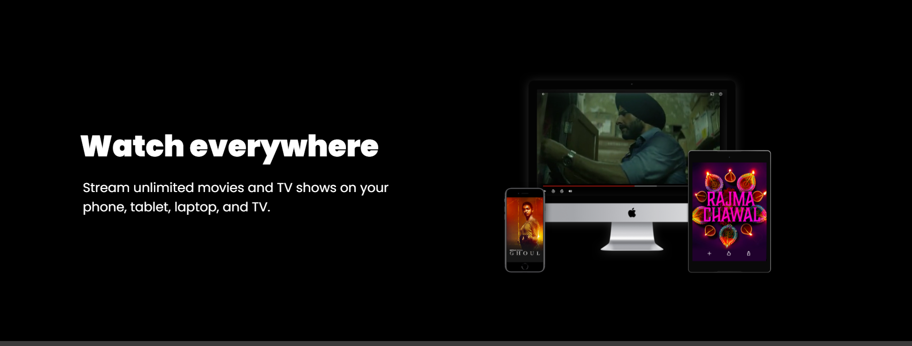
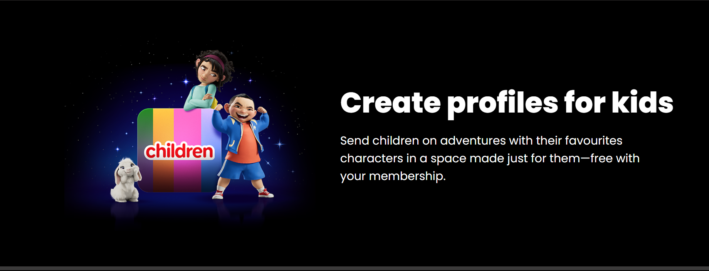
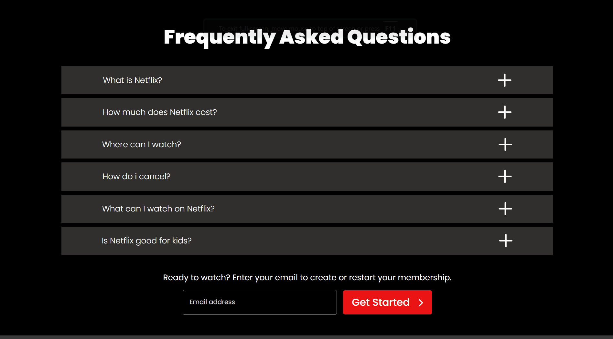
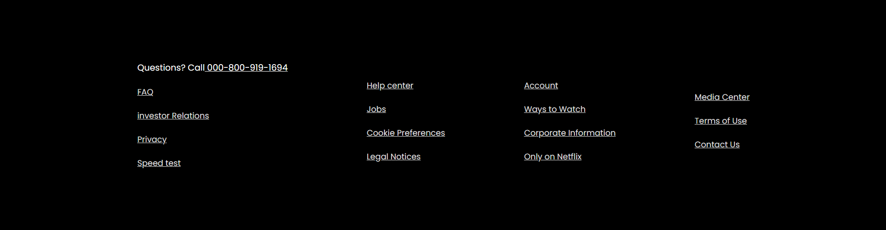

# Netflix UI Clone

## Table of Contents
- [Preview Images](#preview-images)
- [Features](#features)
- [File Structure](#file-structure)
- [Images](#images)
- [How to Use](#how-to-use)
- [Important Notes](#important-notes)

## Preview Images

This project is a static Netflix UI Clone that simulates the design of the popular streaming platform. The layout includes various sections such as a navigation bar, hero section, multiple content sections (TV, Download, Watch Everywhere, Kids), and an FAQ section. **Please note that this layout is not responsive** and is intended for desktop view only.

## Features

- **Navigation Bar:** Includes the Netflix logo, language selector, and sign-in button.
- **Hero Section:** A bold and prominent hero section with a background image and call-to-action buttons for starting membership.
- **TV Section:** Highlights the ability to watch Netflix on smart TVs, with a video element embedded in the image.
- **Download Section:** Promotes the option to download content and watch offline, with accompanying text and image.
- **Watch Everywhere Section:** Illustrates Netflix's cross-device streaming capabilities with a video.
- **Kids Section:** Describes Netflix's kid-friendly profiles, with a vibrant accompanying image.
- **FAQ Section:** Contains frequently asked questions about Netflix, with expandable answers.
- **Footer:** Includes helpful links such as FAQ, privacy, account settings, and contact information.

## File Structure

- **index.html:** The main HTML file containing the structure of the webpage.
- **style.css:** The CSS file containing all styles applied to the HTML structure.
- **images/**: A directory containing images used in the layout (e.g., logos, section images).

## Images

Place the following images in the `images/` directory:

1. **Logo Image:** `logo-1.png` - This image is used as the Netflix logo in the navigation bar.
2. **Hero Image:** `main.jpg` - The main background image for the hero section.
3. **TV Section Video:** `section1-1.m4v` - The video that plays within the TV section image.
4. **TV Section Image:** `section1.png` - The background image used in the TV section.
5. **Download Section Image:** `section2.jpg` - The image used for the download section.
6. **Watch Everywhere Video:** `section3.m4v` - The video used in the Watch Everywhere section.
7. **Kids Section Image:** `section4.png` - The image used for the kids' section.

## How to Use

1. Clone the repository to your local machine.
2. Ensure that all image files are placed in the `images/` directory.
3. Open `index.html` in your preferred web browser to view the layout.
4. Modify the HTML and CSS files to fit your content or design requirements.

## Important Notes

- **Non-Responsive Layout:** This layout is designed for desktop view and does not include responsive features for mobile or tablet devices.
- **Static Design:** This project is a static layout and does not include any dynamic features like user authentication, database interaction, or real-time updates.
- **Disclaimer:** This project is a UI clone of the Netflix website created for educational purposes only. It is not an official Netflix website and is not affiliated with or endorsed by Netflix, Inc. or its subsidiaries.